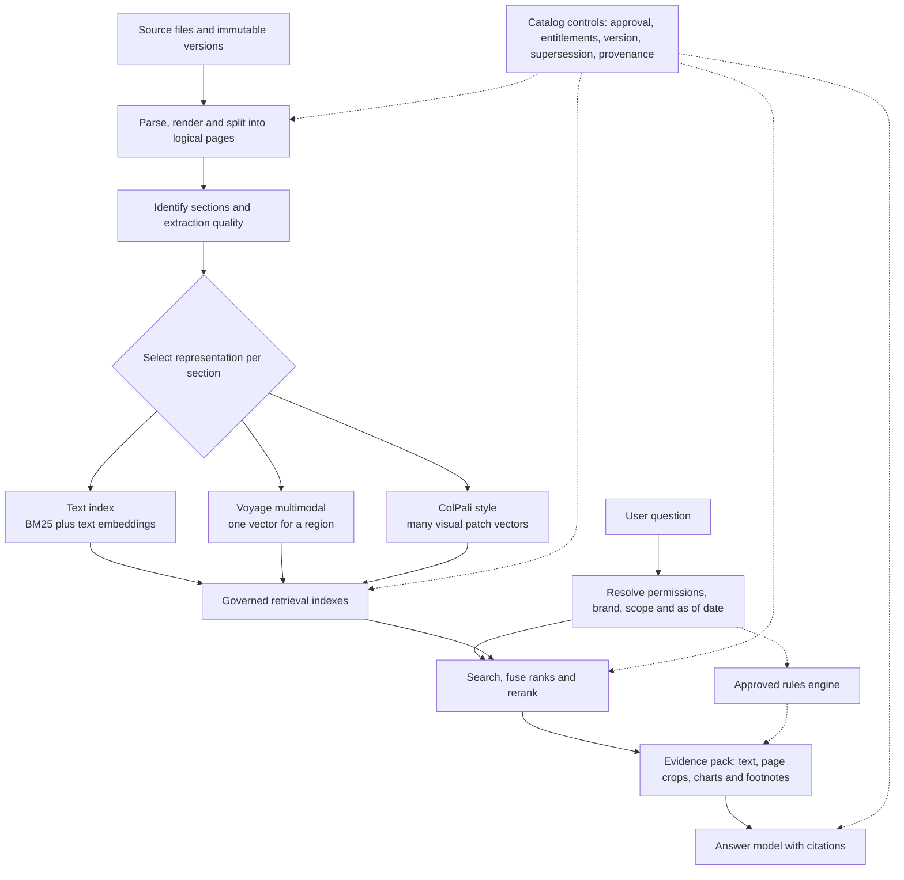
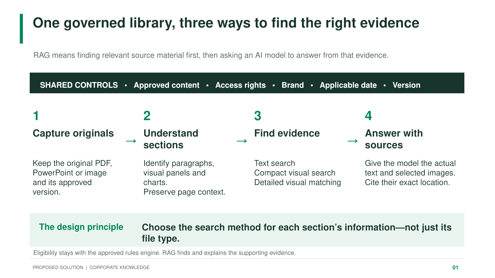
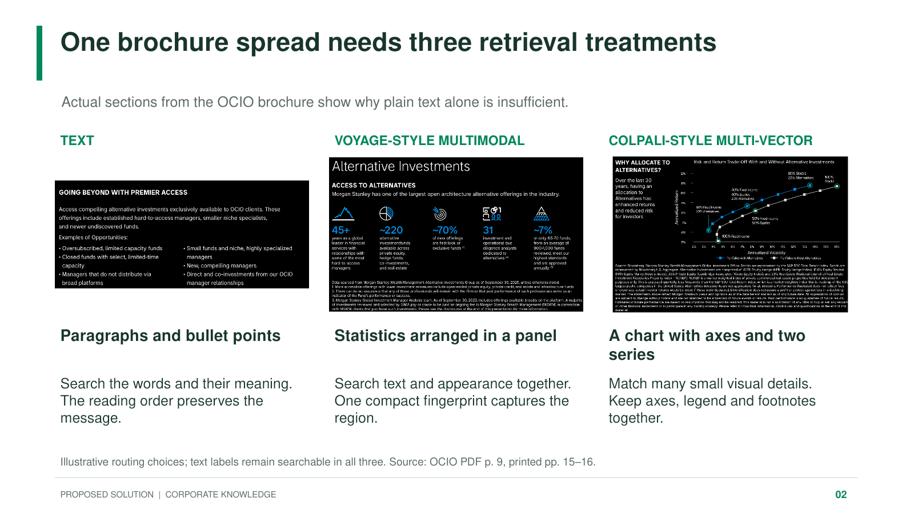
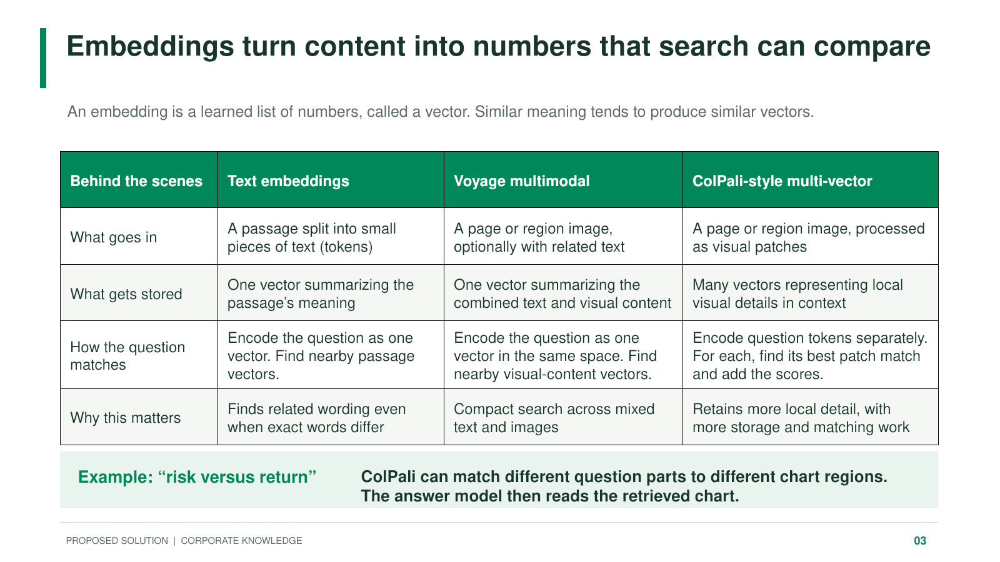
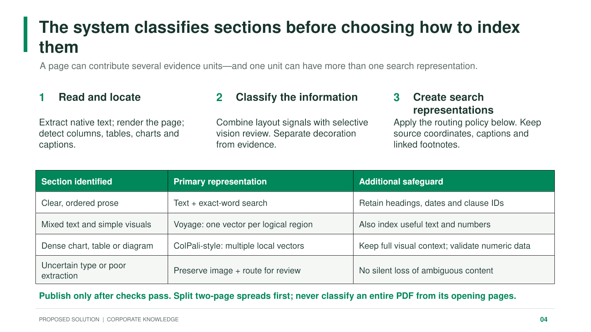
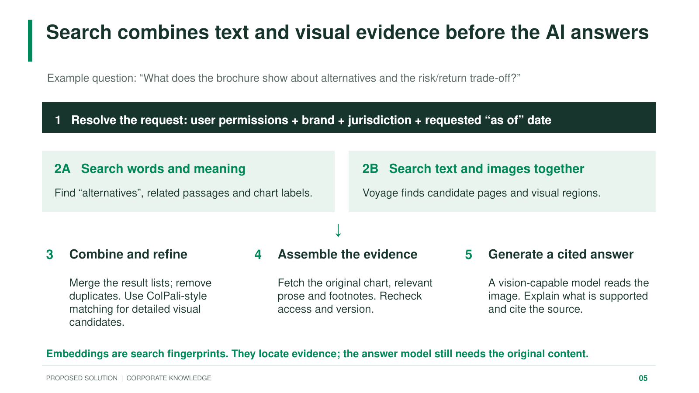
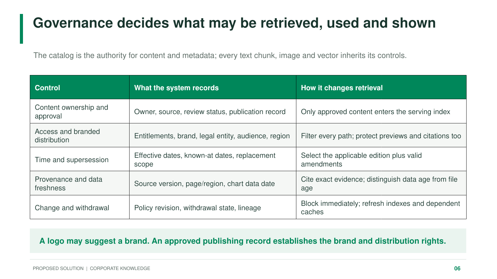

# Corporate Multimodal RAG Solution

## Revised RAG architecture flow

The router operates at page and subsection level. A single page may produce several evidence units, and one unit may receive more than one representation.

**Boundary:** the approved rules engine determines eligibility. RAG retrieves and explains the supporting content; it does not derive rules at runtime.

---

## Slide 1: One governed library, three ways to find the right evidence

---

## Slide 2: One brochure spread needs three retrieval treatments

---

## Slide 3: Embeddings turn content into numbers that search can compare

---

## Slide 4: The system classifies sections before choosing how to index them

---

## Slide 5: Search combines text and visual evidence before the AI answers

---

## Slide 6: Governance decides what may be retrieved, used and shown

---

