```mermaid
gantt
    title Design 1: 24-Hour Data Processing Timeline
    dateFormat HH:mm
    axisFormat %H:%M
    
    section Nightly Batch
    Bulk Feed Arrival           :00:00, 30m
    Staging Load                :00:30, 30m
    Validation & Deduplication  :01:00, 30m
    Dimension Updates (Type 1)  :01:30, 30m
    Fact Table Updates          :02:00, 30m
    MV Refresh (COMPLETE)       :02:30, 2h
    Overlay Truncate            :04:30, 5m
    Cleanup                     :04:35, 5m
    
    section Intraday Processing
    CDC Messages Arrive         :08:00, 12h
    Micro-batch Processing       :08:00, 12h
    Overlay Updates              :08:00, 12h
    
    section MV Refresh Cycle
    MV Refresh #1 (15 min)      :08:15, 2m
    MV Refresh #2 (30 min)      :08:30, 2m
    MV Refresh #3 (45 min)      :08:45, 2m
    MV Refresh #4 (60 min)      :09:00, 2m
    MV Refresh Continues...      :09:00, 11h
    
    section UI Queries
    Summary Grid Queries        :08:00, 12h
    Detail Grid Queries         :08:00, 12h
```

# ADR-012: Data Flow Timeline Diagrams
## Visual Representation of Data Processing Lifecycle

**Document Purpose:** This document provides visual flow diagrams showing the complete data lifecycle from nightly feed through intraday updates, MV refreshes, and UI queries for both design approaches.

---

## Table of Contents

1. [Design 1: Main Design (v5) - Complete Timeline](#design-1-timeline)
2. [Design 2: Gilfoyle Revised - Complete Timeline](#design-2-timeline)
3. [Side-by-Side Timeline Comparison](#timeline-comparison)
4. [Partition Exchange vs Full Merge: Nightly Update Comparison](#partition-exchange-comparison)
5. [Detailed Flow Diagrams](#detailed-flows)

---

## Design 1: Main Design (v5) - Complete Timeline {#design-1-timeline}

### 24-Hour Timeline Overview



---

### Detailed Data Flow: Nightly Batch Process


---

### Detailed Data Flow: Intraday CDC Processing


---

### State Transitions: Before/After Nightly Update


---

### Data State at Key Timestamps

#### T-0: Before Nightly Update (22:59:59)


#### T+1: After Nightly Update (02:35:00)


#### T+2: After Intraday Update (14:30:05)


#### T+3: After MV Refresh (14:32:00)


---

## Design 2: Gilfoyle Revised - Complete Timeline {#design-2-timeline}

### 24-Hour Timeline Overview


---

### Detailed Data Flow: Nightly Batch Process


---

### Detailed Data Flow: Intraday CDC Processing


---

### State Transitions: Before/After Nightly Update


---

### Data State at Key Timestamps

#### T-0: Before Nightly Update (22:59:59)


#### T+1: After Nightly Update (02:35:00)


#### T+2: After Intraday Update (14:30:05)


#### T+3: After MV Refresh (14:30:08)


---

## Side-by-Side Timeline Comparison {#timeline-comparison}

### Complete 24-Hour Cycle Comparison


---

### Operation Count Comparison


---

## Partition Exchange vs Full Merge: Nightly Update Comparison {#partition-exchange-comparison}

### Design 1: Full Merge Approach


**Design 1 Characteristics:**
- **Row-by-row processing:** Each of 10M rows compared and updated individually
- **Full logging:** Every change logged for recoverability
- **MV Reconstruction:** Scans entire ACCOUNT_DAY_FCT and rebuilds from scratch
- **Impact:** Long nightly window (45 min), extended table locks

---

### Design 2: Partition Exchange Approach


**Design 2 Characteristics:**
- **Bulk operations:** Data inserted in one organized statement
- **Minimal logging:** Partition exchange is near-instantaneous at metadata layer
- **MV Reconstruction:** Targets only new partition + MV logs for incremental rebuild
- **Impact:** Short nightly window (3 min), minimal locking

---

### MV Reconstruction Process Comparison

```mermaid
sequenceDiagram
    participant Fact as ACCOUNT_DAY_FCT
    participant MV as Materialized View
    participant Oracle as Oracle Engine
    
    rect rgb(198, 40, 40)
        Note over Fact,Oracle: Design 1: Full Reconstruction
        
        Oracle->>Fact: SELECT * FROM ACCOUNT_DAY_FCT<br/>snap_dt >= 2026-02-11
        Fact-->>MV: Stream all 10M+ rows
        Oracle->>MV: GROUP BY rebalance bucket<br/>GROUP BY qlh bucket<br/>Aggregate counts
        Note over Oracle: Full scan of fact table<br/>All aggregations rebuilt<br/>Duration: 1-2 minutes
    end
    
    rect rgb(46, 125, 50)
        Note over Fact,Oracle: Design 2: Incremental Reconstruction
        
        Oracle->>Fact: SELECT * FROM new partition<br/>ACCOUNT_FACT_20260211
        Fact-->>MV: Stream 5M rows (new data)
        Oracle->>MV: Apply dimension lookups<br/>GROUP BY aggregations<br/>Merge with existing MV
        Note over Oracle: Scan only new partition<br/>+ incremental joins<br/>Duration: <5 seconds
    end
```

---


### Design 1: Complete Data Flow with All Components

```mermaid
flowchart TB
    subgraph "Source Systems"
        IIDR[IIDR CDC Source]
        BulkFeed[Nightly Bulk Feed]
    end
    
    subgraph "Message Queue"
        Kafka[Kafka Topic<br/>Partitioned by account_id]
    end
    
    subgraph "Processing Layer"
        BatchConsumer[Spring Batch Consumer<br/>Micro-batches]
        NightlyProcessor[Nightly Batch Processor]
    end
    
    subgraph "Oracle Database - Design 1"
        subgraph "Dimension"
            Dim[ACCOUNT_DIM<br/>Type 1 SCD<br/>Current values only]
        end
        
        subgraph "FactTable"
            Fact1[ACCOUNT_DAY_FCT<br/>Daily snapshots<br/>+ snapshot columns]
        end
        
        subgraph "State Tracking"
            EventState[ACCOUNT_EVENT_STATE<br/>Idempotency tracking]
            CDCState[CDC_APPLY_STATE<br/>Kafka offsets]
        end
        
        subgraph "Real-Time Adjustments"
            Overlay[SUMMARY_HOT_OVERLAY<br/>Delta tracking]
        end
        
        subgraph "Pre-Aggregations"
            MV[Materialized Views<br/>mv_rebalance_summary<br/>mv_qlh_weekly<br/>Refresh: 15-30 min]
        end
    end
    
    subgraph "UI Layer"
        SummaryAPI[Summary Grid API]
        DetailAPI[Detail Grid API]
    end
    
    BulkFeed --> NightlyProcessor
    IIDR --> Kafka
    Kafka --> BatchConsumer
    
    NightlyProcessor --> Dim
    NightlyProcessor --> Fact1
    NightlyProcessor --> MV
    
    BatchConsumer --> EventState
    BatchConsumer --> Dim
    BatchConsumer --> Fact1
    BatchConsumer --> Overlay
    BatchConsumer --> EventState
    BatchConsumer --> CDCState
    
    MV --> SummaryAPI
    Overlay --> SummaryAPI
    Fact1 --> DetailAPI
    Dim --> DetailAPI
    
    style Overlay fill:#f57f17,color:#fff
    style EventState fill:#e64a19,color:#fff
    style CDCState fill:#e64a19,color:#fff
    style MV fill:#0277bd,color:#fff
```

---

### Design 2: Complete Data Flow with All Components

```mermaid
flowchart TB
    subgraph "Source Systems"
        IIDR[IIDR CDC Source]
        BulkFeed[Nightly Bulk Feed]
    end
    
    subgraph "Message Queue"
        Kafka[Kafka Topic<br/>Exactly-Once Semantics<br/>Transactional]
    end
    
    subgraph "Processing Layer"
        BatchConsumer[Spring Batch Consumer<br/>Transactional<br/>Single transaction per message]
        NightlyProcessor[Nightly Batch Processor]
    end
    
    subgraph "Oracle Database - Design 2"
        subgraph "Dimension"
            Dim[ACCOUNT_DIM<br/>Type 2 SCD<br/>Historical versions<br/>effective_from/to dates]
        end
        
        subgraph "FactTable"
            Fact2[ACCOUNT_FACT<br/>Daily snapshots<br/>FK to dimension<br/>Partition exchange]
        end
        
        subgraph "Services"
            Plan[SERVICE_PLAN<br/>DCA/TET enrollment]
            Run[SERVICE_RUN<br/>Execution events]
        end
        
        subgraph "Pre-Aggregations"
            MV[Materialized Views<br/>mv_rebalance_summary<br/>mv_qlh_weekly<br/>FAST refresh: 5 min]
        end
        
        subgraph "Temporary (Batch Only)"
            Staging[ACCOUNT_STG<br/>Temporary staging<br/>account_fact_exch<br/>Exchange table]
        end
    end
    
    subgraph "UI Layer"
        SummaryAPI[Summary Grid API]
        DetailAPI[Detail Grid API]
    end
    
    BulkFeed --> NightlyProcessor
    IIDR --> Kafka
    Kafka --> BatchConsumer
    
    NightlyProcessor --> Staging
    Staging --> Dim
    Staging --> Fact2
    NightlyProcessor --> MV
    
    BatchConsumer --> Dim
    BatchConsumer --> Fact2
    BatchConsumer --> Plan
    BatchConsumer --> Run
    
    MV --> SummaryAPI
    Fact2 --> DetailAPI
    Dim --> DetailAPI
    
    style Dim fill:#0277bd,color:#fff
    style Fact2 fill:#1b5e20,color:#fff
    style MV fill:#2e7d32,color:#fff
    style Kafka fill:#f57f17,color:#fff
```

---

### MV Refresh Comparison

```mermaid
sequenceDiagram
    participant Scheduler as MV Scheduler
    participant MV1 as Design 1 MV
    participant Fact1 as ACCOUNT_DAY_FCT
    participant Overlay1 as SUMMARY_HOT_OVERLAY
    participant MV2 as Design 2 MV
    participant Fact2 as ACCOUNT_FACT
    participant Dim2 as ACCOUNT_DIM
    
    Note over Scheduler,Dim2: MV Refresh Cycle Comparison
    
    rect rgb(198, 40, 40)
        Note over Scheduler,Overlay1: Design 1: COMPLETE Refresh (15-30 min interval)
        Scheduler->>MV1: REFRESH COMPLETE
        MV1->>Fact1: Scan entire partition<br/>Rebuild all aggregations
        Fact1-->>MV1: Return all data
        MV1->>MV1: Recalculate counts<br/>Duration: 1-2 minutes
        MV1->>Overlay1: TRUNCATE overlay<br/>Clear deltas
        Overlay1-->>MV1: Confirmed
        MV1-->>Scheduler: Refresh Complete
    end
    
    rect rgb(46, 125, 50)
        Note over Scheduler,Dim2: Design 2: FAST Refresh (5 min interval)
        Scheduler->>MV2: REFRESH FAST
        MV2->>MV2: Check MV Logs<br/>Incremental changes only
        MV2->>Fact2: Apply delta changes<br/>From MV logs
        MV2->>Dim2: Join for dimension values<br/>If needed
        MV2-->>Scheduler: Refresh Complete<br/>Duration: <5 seconds
    end
```

---

### UI Query Flow Comparison

```mermaid
sequenceDiagram
    participant User as User
    participant UI as React UI
    participant API as Spring Boot API
    participant DB1 as Design 1 Database
    participant DB2 as Design 2 Database
    
    User->>UI: Request Summary Grid<br/>"Show rebalance buckets"
    
    rect rgb(198, 40, 40)
        Note over UI,DB1: Design 1 Query Flow
        UI->>API: GET /api/summary/rebalance
        API->>DB1: Query MV_REBALANCE_SUMMARY<br/>WHERE snap_dt = today
        DB1-->>API: Return MV results
        API->>DB1: Query SUMMARY_HOT_OVERLAY<br/>WHERE snap_dt = today
        DB1-->>API: Return overlay deltas
        API->>API: Combine MV + Overlay<br/>Apply deltas to counts
        API-->>UI: Return combined results
        UI-->>User: Display summary grid
    end
    
    rect rgb(46, 125, 50)
        Note over UI,DB2: Design 2 Query Flow
        UI->>API: GET /api/summary/rebalance
        API->>DB2: Query MV_REBALANCE_SUMMARY<br/>WHERE snap_dt = today
        DB2-->>API: Return MV results<br/>(Already current, refreshed 5 min ago)
        API-->>UI: Return results
        UI-->>User: Display summary grid
    end
```

---

### Data Freshness Timeline

```mermaid
gantt
    title Data Freshness Comparison Over 1 Hour
    dateFormat HH:mm
    axisFormat %H:%M
    
    section Design 1 Freshness
    MV Refresh #1 (15min)      :08:15, 2m
    Stale Period #1            :08:17, 13m
    MV Refresh #2 (30min)      :08:30, 2m
    Stale Period #2            :08:32, 13m
    MV Refresh #3 (45min)      :08:45, 2m
    Stale Period #3            :08:47, 13m
    MV Refresh #4 (60min)      :09:00, 2m
    
    section Design 2 Freshness
    MV Refresh #1 (5min)       :08:05, 3s
    Stale Period #1            :08:05, 4m57s
    MV Refresh #2 (10min)      :08:10, 3s
    Stale Period #2            :08:10, 4m57s
    MV Refresh #3 (15min)      :08:15, 3s
    Stale Period #3            :08:15, 4m57s
    MV Refresh #4 (20min)      :08:20, 3s
    Stale Period #4            :08:20, 4m57s
    MV Refresh #5 (25min)      :08:25, 3s
    Stale Period #5            :08:25, 4m57s
    MV Refresh #6 (30min)      :08:30, 3s
```

---

## Key Metrics Summary

### Processing Metrics

| Metric | Design 1 | Design 2 |
|--------|----------|-----------|
| **Nightly Batch Duration** | ~4.5 hours | ~2.5 hours |
| **MV Refresh Duration** | 1-2 minutes (COMPLETE) | <5 seconds (FAST) |
| **MV Refresh Frequency** | Every 15-30 minutes | Every 5 minutes |
| **Operations per CDC Message** | 7 operations | 1 transaction (3 SQL statements) |
| **Data Freshness (Max Staleness)** | 15-30 minutes | 5 minutes |
| **Permanent Tables** | 11+ tables | 6 tables |
| **Staging Tables (Temporary)** | ACCOUNT_STG | ACCOUNT_STG + account_fact_exch |
| **Overlay Table Required** | Yes | No |
| **Idempotency Management** | Manual (2 tables) | Framework (Kafka) |
| **Nightly Batch Method** | MERGE operations | Partition exchange (instant) |

### Timeline Summary

**Design 1:**
- Nightly batch: 23:00 - 04:35 (4h 35m)
- MV refresh: Every 15-30 minutes, takes 1-2 minutes
- Data can be stale up to 30 minutes

**Design 2:**
- Nightly batch: 23:00 - 02:35 (2h 35m)
- MV refresh: Every 5 minutes, takes <5 seconds
- Data can be stale up to 5 minutes

---

**Document Version:** 1.0  
**Last Updated:** 2026-02-16  
**Author:** Technical Analysis Team
