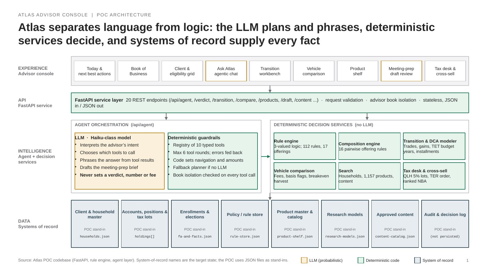
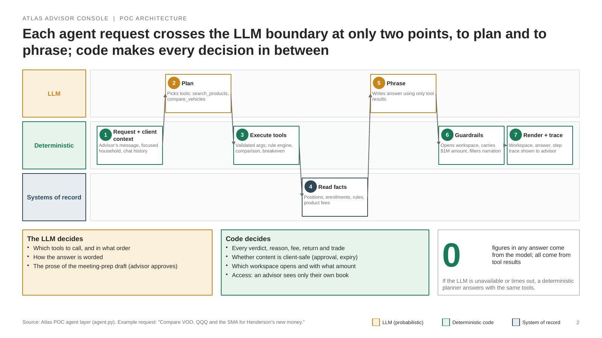
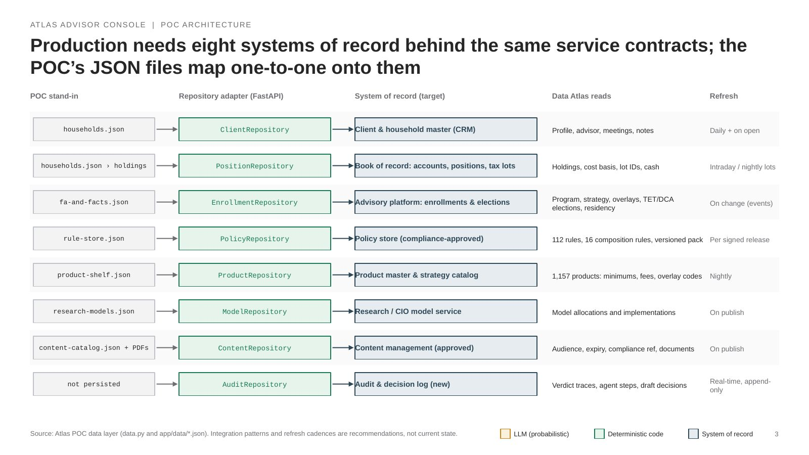
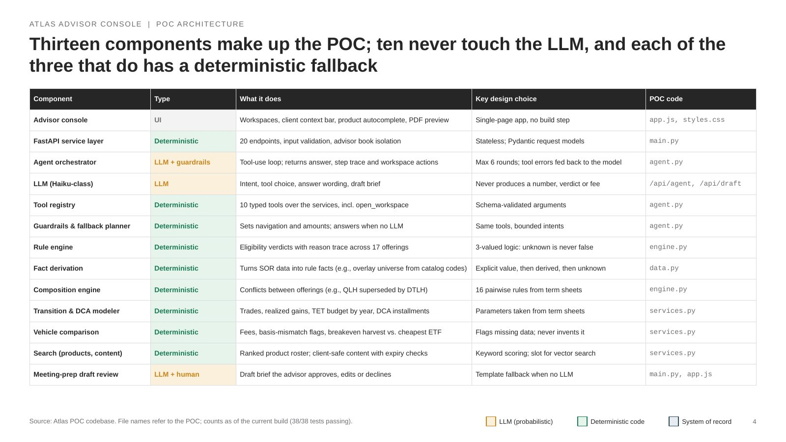
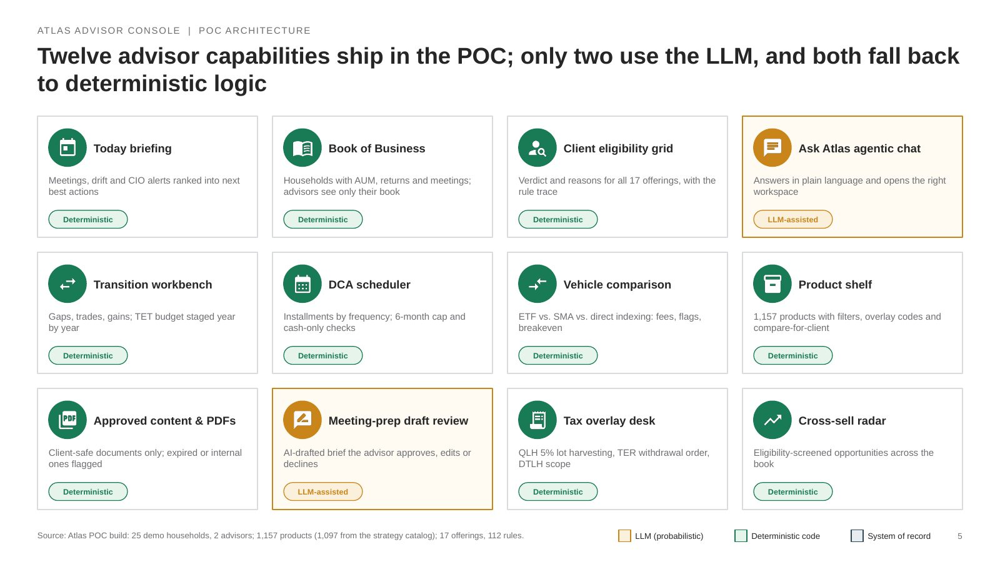

# Atlas Advisor Console: POC architecture

Five slides. Color code on every slide: **amber** = LLM, **green** = deterministic code, **slate** = system of record.

## Slide 1: Layered architecture

**Atlas separates language from logic: the LLM plans and phrases, deterministic services decide, and systems of record supply every fact**

*Speaker notes:* Four layers. Only the amber boxes use the LLM: intent, tool choice, phrasing, and the meeting-prep draft. Every verdict, number, fee and trade comes from the green deterministic services, which read only from systems of record. In the POC those are JSON files; in production each becomes a real SOR behind the same service contract.

---

## Slide 2: Request flow: where the LLM is used

**Each agent request crosses the LLM boundary at only two points, to plan and to phrase; code makes every decision in between**

*Speaker notes:* Walk the example left to right. Steps 2 and 5 are the only LLM calls. Step 6 exists because in testing the model sometimes compared vehicles without opening the workspace or dropped the dollar amount; code now guarantees both.

---

## Slide 3: Systems of record

**Production needs eight systems of record behind the same service contracts; the POC’s JSON files map one-to-one onto them**

*Speaker notes:* Every service in the POC reads data through data.py. Replacing each JSON file with a repository adapter keeps the service contracts unchanged. The audit log is the one new system: the POC shows decision traces on screen but does not persist them, which production must.

---

## Slide 4: Component table

**Thirteen components make up the POC; ten never touch the LLM, and each of the three that do has a deterministic fallback**

*Speaker notes:* Reading the Type column: amber rows touch the LLM, green rows do not. The two LLM-facing components each have a deterministic path, so the POC runs fully without an API key.

---

## Slide 5: Features built

**Twelve advisor capabilities ship in the POC; only two use the LLM, and both fall back to deterministic logic**

*Speaker notes:* Ten of twelve capabilities never call the LLM. Ask Atlas and the meeting-prep draft do, and both have deterministic fallbacks, so the whole POC demos without an API key.

---
