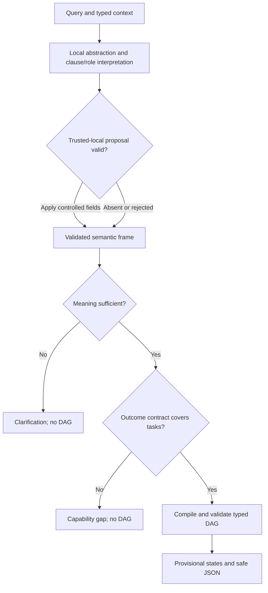

# Current provider transport — 0.8.3

Anthropic now defaults to a forced, non-strict emit_semantic_frame tool response as a data carrier; native JSON schema remains selectable. OpenAI remains on Responses API structured outputs. Both paths validate the identical full semantic contract locally before deterministic capability/DAG compilation. No tool is executed and no second model turn occurs. This workaround avoids native structured-output grammar compilation but does not establish the exact cause of the reported HTTP 400. Masked preview has no approval gate. See MODEL_SETUP.md for setup and limitations.

# Current architecture — API model edition 0.8.1

The primary model interface is now `model_app.py`; see `MODEL_SETUP.md` for the full current setup, privacy boundary, model contract and validation limits. It uses OpenAI or Anthropic structured outputs after local abstraction, with a read-only preview of the exact masked outbound text and no user confirmation gate. This path replaces semantic regex inference; deterministic code still validates labels, matches capabilities and compiles preview DAGs. Invalid or ambiguous model responses cannot produce an executable plan.

The original `app.py` is retained as the offline baseline. All no-LLM/no-egress statements in the historical design below apply to that baseline only. Remote API use is explicitly reported in the model JSON. Catalog definitions live in `data/model_intent_catalog.json`; labels must also be registered with matching governed runtime contracts. No live provider validation has been performed without user keys.

# Wealth Intent Lab: current POC and architecture review

**POC 0.7.0 · Runtime schema 5.1 · September 7, 2026**

This is a standalone description for reviewers with no prior project knowledge. The implementation is a local Python/Streamlit application that interprets advisor requests and previews governed workflows. It does not retrieve client data, perform financial calculations, generate final communications, or execute actions.

## 1. Purpose and scope

A wealth-management advisor may ask for research, portfolio analysis, a tax-aware proposal, personalized communication, or work across a client book. These requests often contain several tasks, unresolved references, private information, and an implicit desired output.

The POC answers four questions:

1. What work and outcome does the advisor appear to request?
2. Does a registered capability cover that request?
3. What context, evidence, functions, and dependencies would be required?
4. Should the calling experience clarify, show a provisional plan, request review, or report a capability gap?

Its design principle is **dynamic interpretation and assembly over versioned, bounded contracts**. The interpretation, selected capability, JSON, and graph vary by query. The allowed vocabulary, function definitions, access paths, and composition policies are authored in code.

The current guarantee is a routing and plan preview. A matched capability is not proof of financial feasibility, available data, authorization, or correct advice.

## 2. Terms and their relationships

| Term | Meaning | Example |
| --- | --- | --- |
| Intent | A controlled task type | `tax.transition` |
| Scope | The subject of the request | `account_or_client`, `subject_set`, `security_or_instrument` |
| Goal | The desired business outcome | `design_tax_aware_concentrated_stock_transition` |
| Output | The requested artifact | `tax_aware_transition_proposal` |
| Capability | A registered way to plan an outcome | `portfolio.tax_aware_concentration_transition` |
| Function | One registered step with input and output names | `evidence.tax_lots` |
| Context binding | Availability and source of a required reference or request detail | `client_reference` |
| Evidence | Data a planned source would retrieve | Tax lots or spread history |
| DAG | Directed acyclic graph: functions connected by data dependencies | Authorize tax lots before retrieving them |

Intents use two-part names such as `portfolio.exposure`, `research.security`, and `content.draft`. The suffix is a catalog label, not always a literal verb. A request can have multiple intents. Capability matching determines whether their combination has an explicit supported outcome.

The runtime has 29 intent definitions. Broad catalog entries are authored previews, not deployed business services. Function counts should be used for inventory only; functions are reused and their number measures neither outcome completeness nor implementation maturity.

## 3. Input contract and privacy

The public entry point is `wealth_intent.runtime.route_request`. The normal input is the query plus optional context and monitoring mode:

```python
result = route_request(
    "How has credit spread moved for this issue, and what is driving it?",
    context={
        "security_reference": {"status": "AVAILABLE", "source": "attachment"},
        "analysis_period": {"status": "AVAILABLE", "source": "attachment"}
    },
    monitor_mode="unspecified"
)
safe_json = export_route(result)
```

The caller provides type/status/source metadata, not actual instrument identifiers or attachment content. Caller sources are `host_application`, `attachment`, `conversation`, and `advisor_selection`. Actor and as-of availability must come from the host application. The interpreter may internally infer reference types from query text, without exporting their values.

The spreadsheet columns **Problem Solved** and **Investment Agent Output** are offline design aids. They are not runtime parameters, are rejected as context keys, and never enter batch inference. The system must infer the request from the actual advisor wording.

| Context state | Meaning |
| --- | --- |
| `AVAILABLE` | Caller asserts a resolved binding; not proof of access or accuracy |
| `PENDING_RESOLUTION` | A source/reference exists and needs resolution |
| `NEEDS_CLARIFICATION` | More request information is required |
| `CONFLICT` | Sources disagree |
| `UNAVAILABLE` | Required information cannot currently be supplied |

No LLM or remote embedding provider is integrated. The gateway send method fails closed. Raw query processing occurs inside the Streamlit host; masking is heuristic and can miss identifying details. Both raw and masked text are excluded from `export_route()`. The internal result still contains local diagnostic text and must not be used as an external export.

All plans and nodes report `verification_status: UNVERIFIED` and `execution_ready: false`. `execution_enabled` and node `invoked` also remain false. These are separate from context availability and planning status.

Production host security, logs, retention, support access, and DLP remain future requirements. Before adding any model, decide explicitly whether the policy prohibits third-party egress or prohibits PII reaching any generative model. The current POC does not require that decision to continue its local preview work.

## 4. Processing flow



The runtime validates supplied context, locally classifies text, refines semantic fields, applies explicit monitoring-mode choices, checks semantic completeness, and then compiles supported plans. Some capability candidates may be identified before clarification; a candidate is not a selected workflow, and its workflow ID remains null until compilation.

Known work with missing bindings can have a provisional graph. For example, the structure of a client email workflow can be known even when the client reference is absent. In contrast, “flag” without a one-time/recurring interpretation changes the workflow and now produces questions without a DAG.

The semantic gate currently uses unresolved baseline clauses, missing prior-task context for follow-ups, empty intent sets, and ambiguous monitoring effect. It does not prove comprehensive understanding of all business nuances.

## 5. Classifier and semantic interpretation

The current baseline uses hand-authored lexical rules and **word-level TF-IDF** fitted over registry examples. It has no character-vectorizer or 0.65/0.35 word/character fusion. Recognized structured-note code patterns are normalized so those strings do not dominate similarity. This normalization is not comprehensive entity recognition.

Rule matches, negation/specificity vetoes, and cosine-similarity decisions are recorded separately. Similarity provides a fallback where a clause has no rule match. Thresholds and margins are heuristic, with different offsets by risk tier; they are not calibrated probabilities.

The baseline influences routing. It is not merely a diagnostic comparison. The semantic layer starts with its intents and then refines intent, scope, goal, output, audience, metric, subject selection, effect, and inferred context types. Unresolved baseline clauses can still trigger clarification.

Semantic refinement remains provisional. The default is a local clause/role parser with explicit handling for positive versus negated clauses, request effects, common wealth synonyms, periods, output forms, and subject selection. Named account lists, selected clients, prioritized clients, and filtered books normalize to `subject_set`; `subject_selection` retains the access strategy. This makes equivalent population queries share the same capability and DAG without erasing how the population must be resolved.

An optional trusted-local model interface may propose only controlled semantic fields. It receives locally masked and abstracted text, not typed client context; low-confidence fields are ignored, unknown fields are rejected, and a deterministic contract validates cross-field consistency. The model never selects function IDs, access paths, permissions, or graph edges. No model is configured in the shipped POC.

## 6. Capability support and outcome contracts

Matching is deterministic. Single-task requests have authored task templates. Certain specialized requests have explicit outcomes, such as credit-spread explanation, supplied-content transformation, and rebalance scenarios. Multi-task requests must satisfy an explicit composition policy.

Version 0.5.0 removed `analysis.explanation_package` and `operations.guidance_package` as generic routable fallbacks. An arbitrary supported task set no longer automatically becomes a supported outcome. Unsupported compositions return `CAPABILITY_GAP` and `uncovered_intents`, without a compiled graph.

Two authored composition contracts added in this release are:

| Capability | Contract |
| --- | --- |
| `portfolio.tax_aware_concentration_transition` | Exact exposure + tax transition + solution matching task set; proposal sections and material assumptions |
| `book.holdings_signal_analysis` | Book-scoped research combined with exposure/screening within an allowlisted task set |

The existing monitoring composition is restricted to market research, exposure, and book-screening tasks plus monitoring. The rebalance specialization also restricts accompanying tasks. Additional unsupported tasks produce gaps instead of being silently dropped.

Support metadata distinguishes `AUTHORED_TASK_PREVIEW`, `CONTRACTED_COMPOSITION_PREVIEW`, and `UNSUPPORTED`. All matched definitions remain `AUTHORED_NOT_DOMAIN_VALIDATED`. A specific capability name is not sufficient evidence of correctness. Existing specialized/task templates still need detailed domain validation; formal required-section definitions currently exist for the two new compositions.

### Transition-proposal contract

The concentrated-stock proposal requires these output sections:

- concentration assessment;
- transition scenarios;
- realized-gain estimates;
- candidate-solution comparison;
- assumptions and limitations.

Its request inputs include comparison targets, gain budget, transition horizon, tax assumptions, client objectives, and client constraints. Recognizing “tax-aware concentrated stock” does not establish a complete investment profile or automatically satisfy those inputs.

The graph represents an authorized subject snapshot producing a portfolio reference. Tax-lot retrieval uses that upstream reference, removing the separate portfolio-reference question for a client-scoped proposal. A registered assumption-contract step explicitly binds gain budget, horizon, and tax assumptions into the transition artifact path.

These are declared inputs and sections. The POC does not calculate gains or verify a finished proposal; real payload schemas and financial methods remain outstanding.

## 7. DAG mechanics and field origins

Every function declares an ID, version, named inputs and outputs, function class, access path, permission, and PII policy. An access path such as `tax_lot_gateway` is a registered name, not an implemented endpoint or credential.

The compiler binds inputs from one of four sources:

| Binding source | Example |
| --- | --- |
| Context | Caller-asserted `client_reference` |
| Configuration | Versioned methodology or output-contract ID |
| Upstream output | `authorized_account_or_client` from an authorization node |
| Artifact collection | Exposure and transition artifacts feeding solution matching |

Resolution and authorization nodes depend on the selected scope. Evidence reads depend on research authorization, while private sources have additional evidence-specific authorization dependencies. Shared evidence is reused. `artifact.collect` connects prior task results to downstream tasks. `result.validate` binds the requested artifacts at the end.

The validator checks registered functions, exact named inputs, producer-output names, dependency edges, unique IDs, forward references, and cycles. It does **not** validate field-level payload schemas, currencies, units, lot cardinality, temporal consistency, methodology correctness, or actual financial content. JSON explicitly labels this guarantee `NOMINAL_TYPES_ONLY`.

| Graph element | Origin |
| --- | --- |
| `n001`, `n002`, etc. | Sequential compiler allocation; local to the plan |
| Function name | Registry definition selected by the compiler |
| Arrow | Explicit upstream or collection binding |
| Node status | Direct context state and upstream planning state |
| `UNVERIFIED` label | Explicit POC assurance status on every node |
| Color | Streamlit mapping of planning status; planned nodes are no longer green |

The displayed Graphviz graph and exported JSON derive from the same compiled node list.

## 8. Decisions and readiness

Three independent dimensions must be read together:

| Dimension | Values and meaning |
| --- | --- |
| Decision | `CLARIFY`, `REVIEW`, `CAPABILITY_GAP`, `ROUTE_PREVIEW` |
| Plan status | `NOT_COMPILED_SEMANTIC_CLARIFICATION`, `NOT_COMPILED_CAPABILITY_GAP`, `PROVISIONAL_MISSING_BINDINGS`, `PREVIEW_ONLY` |
| Verification | Always `UNVERIFIED`; never evidence of authorization |

`CLARIFY` can mean unresolved semantics or missing request bindings. `REVIEW` surfaces conflicting/unavailable required context or an action-related specification; there is no dispatched review queue. `CAPABILITY_GAP` exposes unsupported outcomes. `ROUTE_PREVIEW` means a preview can be inspected; it can still contain pending host context and evidence.

Nodes retain `PLANNED`, `NEEDS_INPUT`, `PENDING_CONTEXT`, `BLOCKED`, `CONFLICT`, and `UNAVAILABLE`. `PLANNED` means input bindings are structurally planned or asserted available. It never means that a permission was granted or a read occurred. This release keeps planning state separate from verification rather than introducing a status that combines them.

## 9. JSON contract

Principal fields and their sources:

| Fields | Source |
| --- | --- |
| `intents`, `scope`, `goal`, `output`, `metric`, `audience`, `requested_effect` | Query interpretation |
| `capability_id`, `support_level`, `uncovered_intents` | Outcome matcher |
| `clarification_questions` | Pre-compilation semantic gate |
| `context_requirements` | Every external binding required by the selected workflow |
| `clarification_required` | Subset that requires advisor input and drives `CLARIFY` |
| `missing_context` | Deprecated schema-5.x compatibility alias for `clarification_required` |
| `context_actions`, `evidence_requirements` | Compiled functions and their expected evidence outputs |
| `capability_route.nodes` | Dynamic compiler output |
| `plan_status`, `decision`, `reason` | Unified runtime logic |
| `verification_status`, `execution_ready`, `execution_enabled` | Explicit POC safety/assurance contract |
| `privacy_findings`, `egress` | Local privacy scanner and closed gateway |

Example, showing selected fields only:

```json
{
  "schema_version": "5.1",
  "poc_version": "0.7.0",
  "intents": ["portfolio.exposure", "tax.transition", "solution.match"],
  "scope": "account_or_client",
  "goal": "design_tax_aware_concentrated_stock_transition",
  "output": "tax_aware_transition_proposal",
  "capability_id": "portfolio.tax_aware_concentration_transition",
  "support_level": "CONTRACTED_COMPOSITION_PREVIEW",
  "plan_status": "PROVISIONAL_MISSING_BINDINGS",
  "decision": "CLARIFY",
  "verification_status": "UNVERIFIED",
  "execution_ready": false,
  "execution_enabled": false
}
```

Schema 5.1 separates all workflow requirements from advisor clarification. `clarification_required` is canonical; `missing_context` remains an equal, deprecated alias through schema 5.x. This is an additive minor change. Workflow identifiers remain `.v4`.

## 10. Worked scenarios

| Query/context | Current behavior |
| --- | --- |
| Tax-aware concentrated-stock proposal for a client | Specific proposal goal and capability; provisional DAG; explicit missing assumptions/profile context |
| Same proposal with account and other bindings asserted available | Still unverified preview; no retrieval, calculation, or authorization |
| Credit-spread question without instrument or period | Known specialized outcome with missing-binding clarification and provisional graph |
| Same question with an unresolved attachment | Resolution remains pending; no fabricated instrument or period |
| Same question with all references and host context asserted available | `ROUTE_PREVIEW`; evidence remains pending retrieval; all nodes unverified |
| “Flag major estimate revisions … prioritized clients” with unspecified mode | Clarify one-time versus recurring; no DAG |
| Same query with one-time mode | Book holdings-signal composition; subset and book bindings remain explicit |
| Same query with recurring mode | Monitoring specification; threshold, cadence, and channel required; nothing scheduled |
| Client volatility email without client selection | Communication workflow can be provisionally shown with missing client binding |
| Arbitrary overlap + transition task combination | Gap until an explicit output/composition contract is authored |

Attachment controls simulate availability and resolution. The POC does not fetch links, OCR screenshots, resolve instruments, reconcile extracted values, or test attachment injection defenses. Also, the signal contract does not yet implement precise top-holdings ranking or financial materiality; those remain outcome requirements for domain validation.

## 11. Evaluation and evidence

Baseline evaluation already supports provenance strata, rules-only comparisons, and annotation metadata. Version 0.5.0 adds `outcome_evaluation.py` and `scripts/evaluate_outcomes.py` to run both hybrid and rules-only modes through semantic refinement, matching, and planning. A sensitivity option compares nine threshold/margin combinations plus the rules-only floor.

Reports group decisions, support classes, and matched capabilities by explicitly assigned provenance and outcome family. Unknown metadata remains unknown. Query length is not a substitute for provenance. Reports never include raw query text or source business-label prose.

Complete independently adjudicated labels must cover intents, scope, output, capability, decision, and missing context before outcome correctness is counted. Label metadata is consulted only after inference. Without eligible labels, correctness counts are null, not zero and not inferred from coverage. Reviewer independence is an operator assertion; the application does not authenticate it.

Annotation protocol:

1. Prepare complete request/thread units and quarantine uncertain transcriptions.
2. Assign provenance explicitly and keep related threads/paraphrases in one split.
3. Have three independent reviewers label against a frozen guide, blind to predictions and each other's labels.
4. Preserve initial labels; a domain lead adjudicates disagreements with rationale.
5. Measure per-label agreement and set overlap with support counts. Disputed or sparse categories remain provisional.
6. Freeze acceptance criteria before evaluating untouched cases, including false supported outcomes and unnecessary clarification. No universal agreement threshold has been validated here.

No independent human annotation was performed in this update. Source diagnostics and synthetic regression fixtures are development evidence, not production accuracy. See `VALIDATION.md` and generated JSON reports for measured results and limitations.

### Corpus delivered with this POC

`scripts/build_semantic_corpus.py` creates 242 records in 170 source groups from the sanitized source suite and the 92-query semantic probe set. Each record preserves lineage, generation method, privacy-category counts, an optional author hypothesis, and empty reviewer/adjudication fields. Author hypotheses are explicitly non-gold and every record starts with `training_eligible=false`.

`scripts/train_semantic_model.py` fails closed unless a record is adjudicated, complete, independently reviewed by at least three distinct reviewers, and has approved production-like provenance. It also enforces minimum total and per-intent support. Related threads and paraphrases share a group so they cannot leak across train/evaluation splits. The current corpus intentionally causes the trainer to refuse training: it is a review queue, not evidence that a model is ready.

The completed LLM labeling exercise is imported into a separate `semantic_silver.1` dataset. The import intentionally discards the LLM's `capability_id`, `decision`, and `missing_context` labels because those fields duplicate deterministic policy and used a different meaning of “missing.” It retains only the eight semantic fields needed to diagnose interpretation. Quality gates produce 73 high-confidence and 89 medium-confidence records, 72 no-majority diagnostic records, three contract-invalid records, and five unresolved records. Thus 162 records are usable as semantic diagnostics, while all 242 remain non-independent and ineligible for training.

The runtime context model now separates two concepts:

- `context_requirements` lists every binding required by the planned workflow, including facts expected from host systems or governed retrieval.
- `clarification_required` lists only request-specific facts that the advisor must supply or disambiguate.

Pending retrieval does not cause `CLARIFY`; a non-empty `clarification_required` list does. `missing_context` is retained temporarily as a deprecated alias, not as a third concept.

For the v1 diagnostic evaluation, the 162 usable silver records were frozen into 116 development and 46 held-out records using a deterministic group-level stratifier. The split has zero source-group leakage and seeks coverage for each intent with at least two usable examples. Step 5 subsequently targeted disagreements across the full corpus and informed v0.7.0 parser changes, so the former held-out portion must no longer be described as untouched for this release. It remains a reproducible diagnostic partition, not a clean post-change accuracy set.

A separate focused-review package contains 86 unique cases selected from five overlapping reasons: five unresolved, three contract-invalid, 35 intent-disputed, 19 where scope changes downstream capability selection, and 39 where the current POC reports a gap while silver routing reports a preview. Candidate semantic frames from the three passes and the POC are deduplicated and randomized per case; their source identities and routing consequences are kept in a local map that is explicitly excluded from the LLM package. A different model family reviews eight chunks of at most 12 cases and may select an option, revise the frame, identify a taxonomy issue, or leave the case unresolved.

That focused review is now complete. All 86 cases were returned and passed package/schema/option validation. Eighty-four semantic frames passed the runtime contract, one remains unresolved, and one remains pending because the selected frame has no valid scope. The accepted frames produce `semantic_reviewed_silver.2`, with 206 usable diagnostic records across the complete 242-record corpus. The external review remains LLM silver: capability, context, decision, function, and DAG fields were excluded, and all records remain ineligible for training and lack human review.

Repeated review evidence drove only bounded semantic changes: retain explicit CIO evidence in composed requests; keep holdings selection separate from an exposure-calculation intent; recognize fit-oriented solution matching; produce the holdings-signal output for scoped security screening; and permit a null metric for broad market signals. Scope inconsistencies, rating-event taxonomy, monitoring semantics, and new multi-intent capability contracts remain review items rather than being overfit to individual labels. See `STEP5_REVIEW_FINDINGS.md` for exact counts and dispositions.

The 92-query probe suite improved from 16 of 20 preserve-meaning groups with routing differences in v0.5.0 to 3 of 20 in v0.6.0. Those three retain intentional differences in population selection or requested presentation; the matched capability and DAG stay the same. This is regression evidence, not an accuracy estimate.

## 12. Alignment with Investment IQ

Investment IQ proposes advisor surfaces, request interpretation, capability matching, plan compilation, durable orchestration, reusable engines, governance/effect controls, and governed sources. This POC implements the front portion as inspectable metadata.

| Platform component | POC status |
| --- | --- |
| Advisor surface | Streamlit and Python API |
| Intent parser | Local baseline plus clause/role semantic frame; optional gated local model |
| Capability matcher and plan compiler | Implemented preview logic |
| Result binding | Artifact-dependency metadata only |
| Policy and source access | Named contracts; no real authorization/read |
| Financial engines | No calculations implemented |
| Durable orchestrator | No checkpoints, retries, waits, or replans |
| Effects and verification | No operational writes or success verification |
| Audit/lineage | Version and dependency metadata, no durable fact lineage |

The bounded registry approach aligns with the overall architecture. It does not establish production readiness for any plane beyond the preview interface.

## 13. Response to consolidated review

| Finding | Disposition in this release |
| --- | --- |
| 01 Generic fallback | Removed general analytical/operations fallbacks; explicit composition support and coverage distributions |
| 02 Privacy-policy decision | Current no-egress constraint retained; decision required before adding a model |
| 03 Missing payload schemas | Nominal-only guarantee explicitly exposed; real schemas deferred to the first implemented financial outcome |
| 04 REVIEW ownership | Required for live use; no POC queue or dispatch claimed |
| 05 Caller assertions | Separate verification and execution-readiness fields in JSON and graph |
| 06 Compile before clarify | Semantic gate before graph creation; missing-binding provisional plans retained |
| 07 Evaluation | Full-runtime mode comparison, provenance/family strata, label-gated correctness |
| 08 Pattern growth | Positive, negative, unsupported-composition and ambiguity regressions; held-out labels still required |
| 09 TF-IDF critique | Corrected documentation; character fusion absent; full-runtime sensitivity reporting added |
| 10 Attachments | Simulation remains explicit; real extraction deferred |
| 11 Traffic retention | Launch requirement for controlled feedback, not added to local POC |
| 12 Versioning | Experimental schema-major policy and regression coverage |
| 13 Annotation | Existing three-reviewer protocol documented and extended to outcome fields |
| 14 SMA evidence | Deferred to tax/eligibility data implementation; platform-specific terms must retain provenance and unverified status |

The earlier document incorrectly described a character-similarity classifier and understated the existing annotation/evaluation infrastructure. Those descriptions are corrected here. A prior review's functions-per-capability ratio is not a useful completeness measure because functions are shared.

## 14. Next implementation boundary

This release completes the cross-model semantic review and conservative parser update. The next evidence step is human adjudication of the two pending cases plus a sampled audit of accepted cross-model labels, followed by a newly frozen evaluation set that has not informed parser development. Separately, any multi-intent capability gap needs outcome-owner approval before a new composition contract or DAG is registered.

Before a live financial outcome, select one slice and implement its real payload schemas, provenance/freshness rules, financial methodology, entitlement integration, and output acceptance checks. Credit-spread explanation is a bounded candidate; a tax-transition proposal has more material assumptions.

Model integration, production review queues, controlled traffic retention, real attachment ingress, durable orchestration, and consequential effects remain explicitly deferred. None is implied by `ROUTE_PREVIEW`, a dedicated capability ID, or the presence of a complete graph.

## 15. Source map and running the POC

| File | Responsibility |
| --- | --- |
| `registry.py` | Intent definitions and lexical rules |
| `classifier.py` | Rules, word TF-IDF, clause handling and local diagnostics |
| `semantic.py` | Clause/role parsing and semantic dimensions |
| `abstraction.py` | Local masking and model-input abstraction |
| `semantic_model.py` | Trusted-local proposal interface and optional local artifact loader |
| `semantic_contract.py` | Controlled-field and cross-field validation |
| `planning.py` | Outcome contracts, functions, matching, graph compilation and validation |
| `runtime.py` | Public API, semantic gate, decisions and safe export |
| `outcome_evaluation.py` | Full-runtime comparisons and label-gated outcome counts |
| `privacy.py` | Heuristic masking and closed model gateway |
| `app.py` | Streamlit UI and dynamic Graphviz display |
| `scripts/build_semantic_corpus.py` | Grouped corpus and review artifacts |
| `scripts/train_semantic_model.py` | Review-gated local training utility |
| `scripts/consolidate_step5_review.py` | Validate Step 5, restore provenance, and build reviewed silver v2 |
| `data/semantic_reviewed_silver_labels_v2.jsonl` | Consolidated 242-record cross-model semantic-silver dataset |
| `data/step5_review_analysis_v1.json` | Step 5 coverage, acceptance, agreement, and assurance metrics |
| `STEP5_REVIEW_FINDINGS.md` | Review findings, adopted rules, and deliberately deferred changes |
| `tests/` | Functional, privacy, graph, schema and UI regression checks |

Module files above are under `wealth_intent/`, except the application, scripts, and tests. Legacy `capabilities.py` and `workflows.py` remain historical examples and are not the current runtime path.

From the extracted project directory, use Python 3.11+:

```bash
python -m venv .venv
source .venv/bin/activate
python -m pip install -r requirements.txt
python -m streamlit run app.py
```

On Windows activate `.venv/Scripts/Activate.ps1`. Open `http://localhost:8501`. Inference requires no API key or model download. Dependency installation requires package access. Run tests with `python -m pytest -q` after installing `requirements-dev.txt`.
